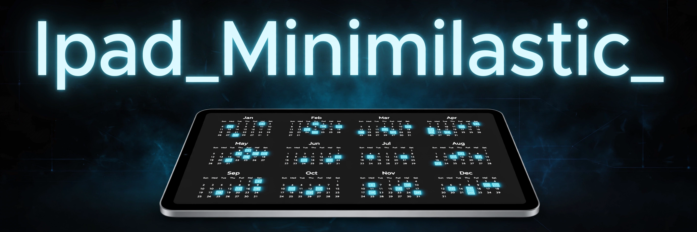

# Ipad_Minimilastic_

> ## Status: 🟢 Completed
>
> <progress value="95" max="100"></progress>
>
> **Progress: 95%** — year-in-pixels calendar app fully built, CI deploys to GitHub Pages successfully

<p align="center">
  
</p>


## What it is

A year-in-pixels calendar app built with Next.js that visualises your progress through the current year inside an iPad 11" mockup. Each day is a cell marked passed, today, or future, with stats (days passed, percentage of year, days left). It also has a `/days` share view sized to iPad dimensions, PNG export of the calendar, iOS web-app support, and shareable URLs for GitHub Pages deployment.

## What works (verified)

- ✅ Year calendar renders 365/366 day cells with correct leap-year handling — verified by reading `components/year-calendar.tsx`
- ✅ Stats (days passed, % of year, days left) computed from the current date — verified in code
- ✅ Share/copy URL flow with clipboard API + fallback — verified in code
- ✅ `/days` route accepts `width`/`height` params for iPad-sized share views — verified `app/days/page.tsx` exists
- ✅ GitHub Actions CI ("Deploy to GitHub Pages") is green — verified via `gh run list`, last run 2026-01-22 succeeded

## Tech stack

| Layer | Technology |
|---|---|
| Framework | Next.js 16 (App Router) |
| UI | React 19, Tailwind CSS 4, Radix UI, shadcn-style components |
| Language | TypeScript 5 |
| Extras | next-themes, lucide-react, html2canvas (PNG export), Vercel Analytics |
| Hosting | GitHub Pages (CI-deployed) |

## How to run

```bash
pnpm install
pnpm dev
```

Then open http://localhost:3000. For the share URL feature, set `NEXT_PUBLIC_BASE_URL` in `.env.local` to your GitHub Pages URL.

Build for production:

```bash
pnpm build
pnpm start
```

## Screenshots

No screenshots in the repo — the app is a visual calendar; the banner above is the visual. The live site is deployed via GitHub Pages CI.

## What you can add more

- [ ] Month/week zoom views — currently year-only; a month grid would make near-term planning useful
- [ ] Custom day marking (habits, moods, events per day) — turns a passive progress display into a tracker
- [ ] Persist marked days in localStorage — currently nothing is saved between visits
- [ ] Dark/light theme toggle wired to next-themes — the provider exists but the calendar styling is fixed

## Project structure

```
Ipad_Minimilastic_/
├── app/
│   ├── page.tsx          # home page, renders YearCalendar
│   ├── layout.tsx        # root layout
│   └── days/             # shareable iPad-sized calendar view
├── components/
│   ├── year-calendar.tsx # core calendar logic + stats + share URL
│   ├── theme-provider.tsx
│   └── ui/               # Radix/shadcn UI primitives
├── hooks/                # use-mobile, use-toast
├── lib/utils.ts
├── public/               # icons, manifest, placeholders
├── banner.webp
└── README.md
```

---
*README written after code audit on 2026-10-08.*
